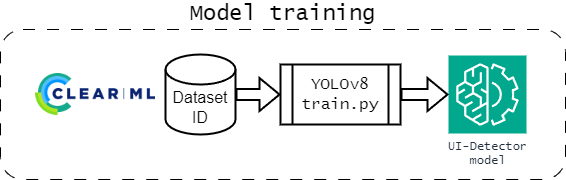

# LVGL UI Detector
Source code for LVGL UI detector model with ClearML tasks for generating, training and optimization.

# Pre-requisites & Installation

This project uses [Poetry](https://python-poetry.org/) for managing dependencies.

## Setting up the virtual environment

1. Install `poetry` package manager. See corresponding [documentation](https://python-poetry.org/docs/#installation) for more information.
2. Run `poetry install` to install the dependencies and prepare the virtual environment.

# Usage

```shell
poetry run python src/<task>.py <task-arguments>
```

# Available tasks

The source contains the following tasks:
- `generate.py` - Task for generating a dataset using [LVGL UI Generator v2]() in either `random` or `design` mode.
- `train.py` - Task for training the YOLOv8 model on a provided dataset ID from ClearML.
- `optimize.py` - Task for optimizing the YOLOv8 model on a provided task ID from ClearML using [Optuna](https://optuna.org/).
- `tune.py` - Task for tuning on a provided dataset ID from ClearML using the tuning functionality of YOLO _(Their built-in hyperparameter optimization)_.

## Generate

The task will generate random UIs using the [LVGL UI Generator v2](https://github.com/HackXIt/lvgl_ui_generator_v2).
It does so by repeatedly calling the generator using the chosen mode and provided parameters for it.

Errors during generation, as well as statistics about the generated dataset, are tracked and reported in the ClearML task.

After finishing the generation, the task will create a ClearML dataset from the output folder.

The details about this are described in the [Dataset section](#dataset-creation), as it is the same for all modes.

<details>
<summary>Help</summary>

```shell
usage: generate.py [-h] [-o OUTPUT_FOLDER] [--mpy-path MPY_PATH] [--mpy-main MPY_MAIN] [-d DATASET] [-s SPLIT_RATIO SPLIT_RATIO SPLIT_RATIO] [--no-dataset]
                   {random,design} ...

Generate UI Detector dataset

positional arguments:
  {random,design}       Type of LVGL UI generator to use
    random              Generate random UI
    design              Generate UI from design files

options:
  -h, --help            show this help message and exit
  -o OUTPUT_FOLDER, --output-folder OUTPUT_FOLDER
                        Output folder (default: tmp/output)
  --mpy-path MPY_PATH   Path to MicroPython binary (loads from environment MICROPYTHON_BIN if not provided) (default: None)
  --mpy-main MPY_MAIN   Path to main.py of micropython script (loads from environment MICROPYTHON_MAIN if not provided) (default: None)
  -d DATASET, --dataset DATASET
                        Custom name of the dataset written in the task comment (default: None)
  -s SPLIT_RATIO SPLIT_RATIO SPLIT_RATIO, --split-ratio SPLIT_RATIO SPLIT_RATIO SPLIT_RATIO
                        Split ratio for train, val, test (default: None)
  --no-dataset          Do not create a ClearML dataset (artifacts are added to Task) (default: False)
Subparser 'random'
usage: generate.py random [-h] [-W WIDTH] [-H HEIGHT] [-c COUNT] [-l LAYOUT] [-x AMOUNT]

options:
  -h, --help            show this help message and exit
  -W WIDTH, --width WIDTH
                        Width of the UI screenshot
  -H HEIGHT, --height HEIGHT
                        Height of the UI screenshot
  -c COUNT, --count COUNT
                        Number of widgets to create per output
  -l LAYOUT, --layout LAYOUT
                        The main container layout of the random UI ["grid", "flex", "none"]
  -x AMOUNT, --amount AMOUNT
                        Amount of outputs per widget class to create

Subparser 'design'
usage: generate.py design [-h] {local,remote,gpt} ...

positional arguments:
  {local,remote,gpt}  Variant of design generator to use
    local             Generate UIs from local design files
    remote            Generate UIs from remote design files
    gpt               Generate UIs using ChatGPT API

options:
  -h, --help          show this help message and exit
```
</details>

### Random mode


The random mode will create a UI window in the provided dimensions and fill it with randomly chosen widgets. This mode will always start from the full list of implemented types.

The provided `count` determines the amount of widgets per screenshot, while the `amount` determines the target amount of widgets per class to be included in the dataset.
Since the generator chooses widget types randomly, the amount of created widget types is tracked.
The generator will remove the widget type from the list of choices once the target amount for that type is reached or exceeded.

This helps ensuring that there is an appropriate and balanced amount of widget types in the dataset.

You can view statistics about the generated dataset in the scalars and reports of the ClearML task.

<details>
<summary>Statistics created in random mode</summary>

</details>

### Design mode

The design mode will create UI windows using design files.

It supports additional modes of operation:
- `local` - Generate UIs from a folder containing local design files
- `remote` - Generate UIs from a remote location containing design files **(not implemented yet)**
- `gpt` - Generate UIs from design files generated by the ChatGPT API

The design files are expected to be in a specific format, which is described in the [Generator README](https://github.com/HackXIt/lvgl_ui_generator_v2/blob/main/README.md).

You can also view the JSON schema for the design files in the [design_schema.json](schema/design_schema.json) file.

<details>
<summary>Statistics in design mode</summary>


</details>

#### Local mode


The local mode expects a folder containing JSON design files.

Design files are not validated against the schema, since the generator will report any missing properties or incorrect values as it encounters them.

The task will go through the folder, calling the generator for each design file, which determines the total iterations of the task.

It will attempt to retry generation up to 4 times, since the generator might fail due to memory issues, which can be resolved by retrying.
Overall this does not affect generation time significantly, since the generator is fast enough when exiting.

Any errors encountered during generation will be reported in the ClearML task and also tracked per iteration.

The created image and annotation file is then renamed and moved into the output folder.
The task will check each annotation file to create statistics about the amount of widgets per class in the dataset. When doing so, it will also verify the bounding box per widget to ensure it is within the image bounds. Any invalid bounding boxes will be reported in the ClearML task and also removed from the annotation file.

The task will show the following scalar statistics:
- Total amount of widgets created
- Total amount of generation errors
- Amount of widgets per class

<details>
<summary>Help</summary>

```shell
usage: generate.py design local [-h] [-f DESIGN_FOLDER]

options:
  -h, --help            show this help message and exit
  -f DESIGN_FOLDER, --design-folder DESIGN_FOLDER
                        Source folder for design generator
```
</details>

#### Remote mode

The remote mode is not implemented yet.

<details>
<summary>Help</summary>

```shell
usage: generate.py design remote [-h]

options:
  -h, --help  show this help message and exit
```
</details>

#### GPT mode


Since creating design files manually can be time-consuming, the GPT mode allows generating design files using a LLM, namely the ChatGPT API.

This is done by first asking the LLM for a design idea in a randomly chosen context and theme. This list contains **10000 options** _(100 contexts combined with 100 themes)_ and is hardcoded currently, see further below.

The design idea is then passed to the LLM again to generate the design file, using the available schema as guidance. The returned JSON by the LLM is validated against the schema and any errors are reported in the ClearML task. The errors are feeded back into the LLM for correction. This is re-attempted 3 times before giving up and moving to the next randomly chosen context and theme.

If the returned design file is valid, it is added to the list to be generated.

Once the desired amount of design files is reached, the task will go through the list and generate the UIs using the generator. This process is then the same as in the local mode.

<details>
<summary>Help</summary>

```shell
usage: generate.py design gpt [-h] [--api-key API_KEY] --model MODEL [--max-tokens MAX_TOKENS] [--designs DESIGNS] [--temperature TEMPERATURE | --top-p TOP_P]

options:
  -h, --help            show this help message and exit
  --api-key API_KEY     ChatGPT API key
  --model MODEL         ChatGPT model name
  --max-tokens MAX_TOKENS
                        ChatGPT maximum tokens
  --designs DESIGNS     Number of designs to generate
  --temperature TEMPERATURE
                        ChatGPT sampling temperature
  --top-p TOP_P         ChatGPT top-p sampling
```
</details>

<details>
<summary>Additional statistics in design mode GPT</summary>

The GPT designer reports on the amount of widgets used in a generated design _(per widget class)_ for each iteration.


</details>

<details>
<summary>100 contexts and 100 themes used</summary>

```python
# Prompted with: Create a list of 100 topics that an embedded user interface could be about.
topics = [
    "Smart Home Control Systems",
    "Wearable Fitness Trackers",
    "Automotive Dashboard Displays",
    "Industrial Automation Interfaces",
    "Agricultural Monitoring Systems",
    "Medical Device Interfaces",
    "Drone Control Panels",
    "Retail Point of Sale Systems",
    "Smart Watches Interfaces",
    "Security System Controls",
    "Marine Navigation Systems",
    "Building Climate Control Systems",
    "Home Appliance Controls (e.g., Smart Refrigerators)",
    "Energy Management Displays",
    "Portable Music Players",
    "Electronic Thermostats",
    "Educational Tablets for Kids",
    "Emergency Alert Systems",
    "Water Purification System Controls",
    "Lighting Control Systems",
    "Portable Gaming Devices",
    "Smart Mirror Technologies",
    "Elevator Control Panels",
    "Vending Machine Interfaces",
    "Fitness Equipment Consoles",
    "Industrial Robot Controllers",
    "Smart Bed Controls",
    "Smart Glasses Interfaces",
    "Pet Tracking Devices",
    "Baby Monitoring Systems",
    "Digital Signage",
    "Ticketing Kiosks",
    "Virtual Reality Headset Interfaces",
    "Library Management Kiosks",
    "Smart Lock Interfaces",
    "Laboratory Equipment Interfaces",
    "Smart Pens",
    "Art Installation Controls",
    "HVAC Control Systems",
    "Railroad Monitoring Systems",
    "Handheld GPS Devices",
    "Digital Cameras",
    "Smart Toothbrushes",
    "Aircraft Cockpit Displays",
    "Electric Vehicle Charging Stations",
    "Soil Moisture Sensors",
    "Smart Jewelry",
    "Pipeline Monitoring Systems",
    "Waste Management Systems",
    "Personal Medical Devices (e.g., Insulin Pumps)",
    "Public Transportation Displays",
    "On-board Ship Computers",
    "Smart Plant Pots",
    "Industrial Pressure Sensors",
    "Interactive Museum Exhibits",
    "Smart Bicycle Systems",
    "Conference Room Booking Displays",
    "Augmented Reality Interfaces",
    "Remote Wilderness Cameras",
    "Interactive Retail Displays",
    "Spacecraft Control Interfaces",
    "Wireless Router Management",
    "Smart City Infrastructure Interfaces",
    "Factory Assembly Line Displays",
    "Car Rental Kiosks",
    "Airport Check-in Kiosks",
    "Digital Billboards",
    "Hospital Room Information Panels",
    "Power Grid Monitoring Systems",
    "Oil Rig Monitoring Interfaces",
    "Smart Suitcases",
    "Fishing Gear Electronics",
    "Underwater Exploration Devices",
    "Digital Menu Boards in Restaurants",
    "Emergency Vehicle Dashboards",
    "Voice-Controlled Home Assistants",
    "Smart Coasters (beverage temperature)",
    "Bicycle Sharing System Terminals",
    "Smart Shower Panels",
    "Mining Equipment Interfaces",
    "Forest Fire Detection Systems",
    "Smart Windows",
    "Interactive Dance Floors",
    "Smart Ring Interfaces",
    "Professional Camera Systems",
    "Home Brewing Systems",
    "Smart Mailboxes",
    "Autonomous Farm Equipment",
    "Wind Turbine Controls",
    "Smart Blinds and Curtains",
    "Logistics Tracking Systems",
    "Parking Garage Equipment",
    "Smart Helmet Displays",
    "Boat Instrumentation Panels",
    "Interactive Park Equipment",
    "Livestock Tracking Systems",
    "Remote Surgery Consoles",
    "Weather Monitoring Stations",
    "Smart Gloves",
    "Electronic Voting Machines"
]

# Prompted with: Create a list of 100 themes that could be applied to these user interfaces.
themes = [
    " Minimalist",
    "Futuristic",
    "Retro",
    "High Contrast",
    "Dark Mode",
    "Light Mode",
    "Nature-inspired",
    "Nautical",
    "Neon Glow",
    "Earthy Tones",
    "Pastel Colors",
    "High Tech",
    "Art Deco",
    "Steampunk",
    "Material Design",
    "Flat Design",
    "3D Depth",
    "Monochrome",
    "Kids-Friendly",
    "Elderly-Friendly",
    "Luxury",
    "Industrial",
    "Sports",
    "Educational",
    "Seasonal (e.g., Winter, Summer)",
    "Holiday Themes (e.g., Christmas, Halloween)",
    "Cartoon",
    "Abstract",
    "Photorealistic",
    "Geometric",
    "Military",
    "Space Exploration",
    "Underwater",
    "Urban",
    "Rural",
    "Health Focused",
    "Accessibility Enhanced",
    "Cultural (e.g., Japanese, Mexican)",
    "Cyberpunk",
    "Virtual Reality",
    "Augmented Reality",
    "Transparent Interfaces",
    "Glass Effect",
    "Vintage Film",
    "Comic Book",
    "Parchment and Ink",
    "Origami",
    "Glow in the Dark",
    "Neon Signs",
    "Hand-drawn",
    "Watercolor",
    "Grunge",
    "Metallic",
    "Zen and Tranquility",
    "Casino",
    "Outer Space",
    "Sci-Fi",
    "Historical Periods (e.g., Victorian, Medieval)",
    "Typography-Based",
    "Animal Print",
    "Floral",
    "Ocean Waves",
    "Desert Sands",
    "Mountainous Terrain",
    "Tropical Paradise",
    "Arctic Freeze",
    "Jungle Theme",
    "Auto Racing",
    "Aviation",
    "Sailing",
    "Rock and Roll",
    "Hip Hop",
    "Classical Music",
    "Opera",
    "Ballet",
    "Theatre",
    "Film Noir",
    "Silent Film",
    "Neon Jungle",
    "Crystal Clear",
    "Witchcraft and Wizardry",
    "Steampunk Mechanisms",
    "Pop Art",
    "Renaissance Art",
    "Graffiti",
    "Pixel Art",
    "ASCII Art",
    "Mosaic",
    "Lego Style",
    "Board Game",
    "Video Game",
    "Dystopian",
    "Utopian",
    "Western",
    "Eastern",
    "Minimalist Text",
    "Bold Color Blocks",
    "Line Art",
    "Optical Illusions",
    "Neon Abstract"
]
combinations = [(t, c) for t in themes for c in topics]
```

</details>

## Train



The training task will train the YOLOv8 model on the provided dataset ID from ClearML.

The task will download the dataset and prepare it for training. It will then start the training process, which will be tracked in the ClearML task.
To allow for later editing and re-using of a task, the dataset path will be overrided with valid local path of the current environment, which can later be viewed in ClearML under parameter `General/data`.

The CLI does not have any options for overriding hyperparameters, as ClearML provides a way to edit them in the task configuration.

The easiest way to work with the task is a training locally for 1 epoch and then clone the task in ClearML to edit the hyperparameters.

<details>
<summary>Help</summary>

```shell
usage: train.py [-h] [--dataset DATASET] [--model MODEL] [--epochs EPOCHS] [--imgsz IMGSZ]

Train a YOLOv8 model on a dataset

options:
  -h, --help         show this help message and exit
  --dataset DATASET  Dataset ID to use for training (default: None)
  --model MODEL      Model variant to use for training (default: None)
  --epochs EPOCHS    Number of epochs to train for (default: 10)
  --imgsz IMGSZ      Image size for training (default: 640)
```
</details>

## Optimize


The optimization task will perform hyperparameter optimization on the paramaters of a provided task ID from ClearML using [Optuna](https://optuna.org/).

It will currently always optimize towards the `mAP50-95` metric, which is the mean average precision of the model on the validation dataset.

In the future, other target metrics will be added to the CLI options.

<details>
<summary>Help</summary>

```shell
usage: optimize.py [-h] [--id ID] [--local] [--pool-period POOL_PERIOD] [--max-jobs MAX_JOBS] [--max-concurrent MAX_CONCURRENT]
                   [--max-iterations MAX_ITERATIONS] [--time-limit TIME_LIMIT] [--top-k TOP_K] [--execution-queue EXECUTION_QUEUE]

Optimize hyperparameters for a ClearML training task

options:
  -h, --help            show this help message and exit
  --id ID               Task ID to optimize (default: None)
  --local               Run the optimization locally (default: False)
  --pool-period POOL_PERIOD
                        Pool period in minutes (default: 5)
  --max-jobs MAX_JOBS   Maximum number of jobs to run (default: 25)
  --max-concurrent MAX_CONCURRENT
                        Maximum number of concurrent tasks (default: 2)
  --max-iterations MAX_ITERATIONS
                        Maximum number of iterations per job (default: 100)
  --time-limit TIME_LIMIT
                        Time limit for optimization in minutes (default: 120)
  --top-k TOP_K         Number of top experiments to print (default: 5)
  --execution-queue EXECUTION_QUEUE
                        Execution queue for optimization (default: training)
```
</details>

## Tune


The tune task will perform hyperparameter optimization on the provided dataset ID from ClearML using the `tune` function of the [ultralytics engine](https://docs.ultralytics.com/reference/engine/tuner/).

It will then report the best hyperparameters found in the ClearML task.

Due to the nature of automatic reporting of ClearML, the main tuning operation will not be a visible experiment in ClearML, but each individual training run will be.

To get a more detailed visualization and also more control over the optimization process, it is recommended to use the `optimize` task.

<details>
<summary>Help</summary>

```shell
usage: tune.py [-h] [--model MODEL] [--dataset DATASET] [--epochs EPOCHS] [--iterations ITERATIONS] [--imgsz IMGSZ] [--optimizer OPTIMIZER]

Tune dataset hyperparameters for a YOLO model

options:
  -h, --help            show this help message and exit
  --model MODEL         Model variant to use for tuning (default: None)
  --dataset DATASET     Dataset ID to use for tuning (default: None)
  --epochs EPOCHS       Number of epochs to train for (default: 30)
  --iterations ITERATIONS
                        Number of iterations to tune for (default: 100)
  --imgsz IMGSZ         Image size for tuning (default: 640)
  --optimizer OPTIMIZER
                        YOLO Optimizer (from: Adam, AdamW, NAdam, RAdam, RMSProp, SGD, auto) (default: AdamW)
```
</details>

# Known issues

- Sometimes the 'Widget metrics' iteration reporting has issues in ordering and as such, the reported scalars might appear incorrect. This occurs, since sometimes a reported value might have been placed in the wrong iteration _(possibly race condition? upload delay?)_ by ClearML and therefor the scalar plot will show a value dropping. This is generally incorrect, since widget count can only increase with each iteration. The issue originates in the reporting mechanism of ClearML and can't be fixed in this source.


# License

This project is licensed under the MIT License - see the [LICENSE](LICENSE) file for details.